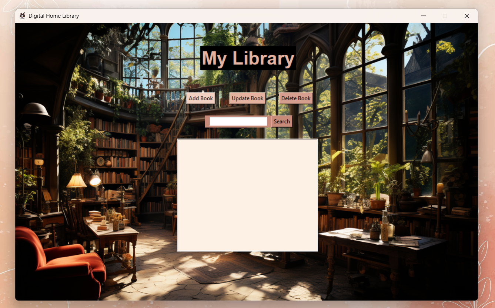
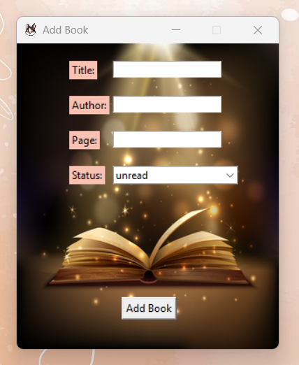
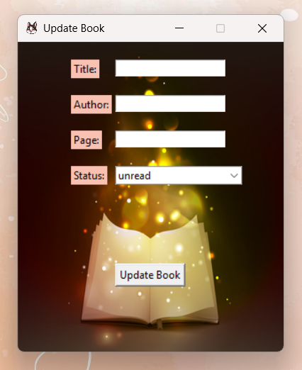
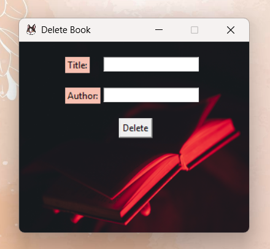
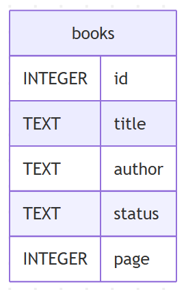

# Digital Home Library


_Created by **Réka Gábosi**_

## Table of Contents

- [Description](#description)
- [Features](#features)
- [Project Files Overview](#project-files-overview)
- [Database Design](#database-design)
- [Installation](#installation)
- [Design Choices](#design-choices)
- [Testing](#testing)
- [Acknowledgments](#acknowledgments)
- [Demo](#demo)

## Description

**Digital Home Library** is made in `Python`, it's a graphical user interface program, designed to help users to manage all the books they own at home.
The program allows users to **add**, **update**, **delete** and **search** books within an `SQLite` database, it also tracks whether the user have
**read**/ **unread** a book and which page are they at, if they haven't finished reading a book.

The interface is built using the `Tkinter` library, making it more user-friendly.

## Features

### User Interface

**Graphical User Interface:** built with `Tkinter`, using buttons and entry fields.

### Book Management

* **Search Books:** Find books with their **title** or **author**.

<div align="center">
    
</div>

* **Add Books:** To add books to the database, with entering the **title** of the book, the **author**, the **status** in which the book is, if it's read or unread and the **page** count.

<div align="center">
    
</div>

* **Update Books:** To update the **status** and the **page** count of a book. It's important to enter the title and the author, so that the program knows which book are we updating.

<div align="center">
    
</div>

* **Delete Books:** To delete a book from the database, by entering their title and author.

<div align="center">
    
</div>

## Project Files Overview

* `main.py` - The main program, which runs the Digital Home Library.
* `images/` - Contains both the images for the GUI, README, and the demo video.
* `library.db` - SQLite database which stores books; it is generated on the first run.
* `requirements.txt` - A file listing the dependencies required to run the application.
* `README.md` - Project documentation.
* `LICENSE` - The license file for the project (CC BY-ND 4.0).

## Database Design

### Scope

The database is designed to efficiently store and manage all the books the user will add to the database.

### Functional Requirements

* Stores essential book details.
* Allows easy modification and retrieval for any book.

### Representation

The SQLite database has a single table named **books** with the following schema:

<div align="center">
    
</div>

* **id:** which specifies the unique ID for each book as an `INTEGER`. This will be the `PRIMARY KEY`.
* **title:** which specifies the title of the book as `TEXT`.
* **author:** which specifies the author of the book as `TEXT`.
* **status:** which specifies whether the book is read or unread as `TEXT`. A check will ensure that no other value is entered here other then read and unread.
* **pages:** which specifies the page count of the book.

All columns in the **books** table are required and hence they should have the `NOT NULL` constraint applied. For pages I wasn't sure if I should require it, but I think it's nice for people to look back on how many pages they have read.

## Installation

### Prerequisites

* Ensure you have Python installed (version 3.x recommended).
* Library installed with:

Option 1: Install Pillow library manually
```bash
pip install pillow
```
Option 2: Install all dependencies from requirements.txt
```bash
pip install -r requirements.txt
```

### Running the Application

1. Clone this repository or download the files.
2. Run the application by entering in the terminal the following:

```bash
python main.py
```

## Design Choices

### Modularity

Each function is made to handle specific tasks, like adding, updating, deleting and searching books. Like this the code is more readable.

### SQLite for Data Storage

SQLite was chosen for its easy integration with Python and easy usage. It handles data efficiently without requiring an external database.

### Tkinter for GUI

Tkinter is a simple built-in solution for creating graphical applications in Python. Making the project more user-friendly.

## Testing

Manual testing was conducted by interacting with the GUI to verify all features, including adding, updating, searching, and deleting books.

## Acknowledgments

- This project was created as a final project for **Harvard University's CS50’s Introduction to Computer Science** online course.
- Additional skills and knowledge were gained through completing:
  - **CS50’s Introduction to Programming with Python**
  - **CS50’s Introduction to Databases with SQL**
- Special thanks to [Codemy.com YouTube Channel](https://www.youtube.com/@Codemycom) for providing excellent tutorials on `Tkinter` GUI development.

## Demo

Check out the demo of how the Digital Home Library works:

[View Demo Video](images/readme_images/demo.mp4)